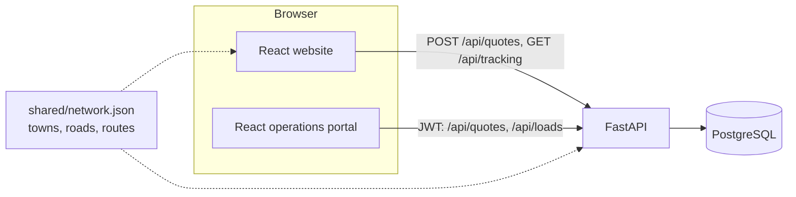

# Expeditors Logistics Limited

Website and operations portal for Expeditors Logistics, a family-owned trucking company in Lusaka, Zambia, operating since 2017 with refrigerated (3 to 5 t) and containerised (2 and 3 t) trucks.

- **Public website:** services, fleet, the family story and team, an interactive route map of Zambia (South Africa coming soon), a route planner, quote requests, load tracking and customer reviews.
- **Operations portal** (`/#admin`): the family signs in to see quote requests, send rates on WhatsApp, book loads, post status updates, send customers their tracking link and approve reviews before they go on the website.

## Architecture



| Layer | Stack |
|---|---|
| Frontend | React 19, TypeScript, Vite |
| Backend | Python 3.11+, FastAPI, SQLAlchemy 2, Pydantic 2 |
| Database | PostgreSQL 16, Alembic migrations |
| Auth | Email and password, bcrypt hashes, JWT bearer tokens |
| Tooling | Docker Compose, pytest, Vitest, Ruff, VS Code configs |

The route network (towns, border posts, roads, distances) lives once in `shared/network.json` and is read by both the frontend (map, planner) and the backend (distance on quote requests, place names on tracking updates), so both always agree.

## Project layout

```
backend/
  app/
    api/routes/     auth, quotes, loads, reviews, tracking, network endpoints
    core/           settings, security (JWT, bcrypt), rate limiting
    db/             engine and sessions
    models/         SQLAlchemy tables: users, quotes, loads, load_events, reviews
    schemas/        Pydantic request and response models (camelCase JSON)
    services/       route network, references, email notification
    cli.py          create staff users, seed sample data
  alembic/          database migrations
  tests/            pytest suite
frontend/
  src/
    api/            typed API client (http.ts) and in-browser demo backend (demo.ts)
    sections/       public website sections
    admin/          operations portal
    map/            interactive SVG map
    lib/            route network, formatting, hash routing
    config.ts       company details (address, phones, WhatsApp, emails)   <- edit this
shared/network.json route network used by both sides
docker-compose.yml  PostgreSQL, API and website
render.yaml         one-click deploy blueprint for Render
Makefile            common commands
api.http            example API requests (VS Code REST Client)
```

## Run it

### Option A: everything in Docker

Needs Docker (Docker Desktop, or Colima on a Mac).

```bash
docker compose up --build
```

Then, in a second terminal:

```bash
docker compose exec api python -m app.cli create-user --email you@example.com --name "Your Name"
docker compose exec api python -m app.cli seed-demo      # optional sample data
```

Website: http://localhost:8080 · Portal: http://localhost:8080/#admin · API docs: http://localhost:8000/api/docs

### Option B: develop in VS Code

Needs Python 3.11+ (`brew install python@3.12` on a Mac), Node 20+ and Docker for the database.

1. Open the folder in VS Code and install the recommended extensions when prompted.
2. `make setup` (or `make setup PYTHON=python3.12`) installs Python (in `backend/.venv`) and npm dependencies and creates `backend/.env`.
3. `make db` starts PostgreSQL in Docker, then `make migrate` creates the tables.
4. `make user EMAIL=you@example.com NAME="Your Name"` creates your staff login. `make seed` adds sample data.
5. Run and debug: pick **Full stack** in the Run and Debug panel (API with breakpoints plus the website in Chrome), or run `make api` and `make web` in two terminals.

Website: http://localhost:5173 · Portal: http://localhost:5173/#admin · API docs: http://localhost:8000/api/docs

### Option C: website only, no backend

```bash
cd frontend && npm install && npm run dev:demo
```

Everything works with sample data kept in the browser. `npm run build:demo` makes a single-file demo in `frontend/dist-demo/`.

## Tests

```bash
make test     # pytest (API) + Vitest and TypeScript checks (frontend)
make lint     # Ruff
```

## Configuration

**Company details** are in `frontend/src/config.ts`: address, phone numbers, WhatsApp number, emails, director, year founded.

**Backend settings** come from environment variables (see `backend/.env.example`):

| Variable | Purpose |
|---|---|
| `DATABASE_URL` | PostgreSQL connection string |
| `SECRET_KEY` | Long random string used to sign login tokens |
| `CORS_ORIGINS` | Website addresses allowed to call the API, comma separated |
| `PUBLIC_SITE_URL` | Public website address |
| `SMTP_HOST`, `SMTP_USER`, `SMTP_PASSWORD`, `NOTIFY_EMAIL` | Optional: email every new quote request. `NOTIFY_EMAIL` takes several addresses separated by commas. Gmail needs an app password |

## API

| Method | Path | Who |
|---|---|---|
| POST | `/api/quotes` | Public (rate limited, honeypot spam check) |
| GET | `/api/tracking/{ref}` | Public (no customer, driver or price data) |
| GET | `/api/reviews` | Public: approved reviews and the average rating |
| POST | `/api/reviews` | Public (rate limited, honeypot). New reviews wait for approval |
| GET | `/api/network/route?from=&to=` | Public |
| POST | `/api/auth/login` · GET `/api/auth/me` | Staff |
| GET, PATCH | `/api/quotes`, `/api/quotes/{id}` | Staff |
| GET, POST, PATCH, DELETE | `/api/loads`, `/api/loads/{ref}` | Staff |
| POST | `/api/loads/{ref}/events` | Staff: status update |
| GET | `/api/reviews/all` | Staff: every review, for moderation |
| PATCH, DELETE | `/api/reviews/{id}` | Staff: approve, hide or delete |

Interactive docs at `/api/docs`.

## Deploy

**Render (simplest):** push this repository to GitHub, then in Render choose New > Blueprint and select it. `render.yaml` creates the database, the API and the website. Update `CORS_ORIGINS` and `VITE_API_URL` if you rename the services, then create your staff login from the API service's Shell tab:

```bash
python -m app.cli create-user --email you@example.com --name "Your Name"
```

Free tiers sleep when idle and free databases can expire, so move to a paid plan before relying on it for customers.

**Anywhere with Docker:** the `backend/Dockerfile` runs migrations on start and serves on `$PORT`. The website is a static build (`frontend/dist`) that can go on Netlify, Vercel, Cloudflare Pages or the included nginx image. Set `VITE_API_URL` at build time when the API is on a different domain.

**Custom domain:** point the domain at the website host, and optionally `api.` at the API. Add both to `CORS_ORIGINS`.

### Quote emails

To have every quote request emailed to the company inbox, create a Gmail app password for the company Gmail account (Google Account > Security > 2-Step Verification > App passwords), then put this in a file called `.env` next to `docker-compose.yml` and run `docker compose up -d` again:

```bash
SMTP_HOST=smtp.gmail.com
SMTP_USER=expeditorsafrica@gmail.com
SMTP_PASSWORD=the-16-letter-app-password
NOTIFY_EMAIL=expeditorsafrica@gmail.com
```

Add more addresses to `NOTIFY_EMAIL`, separated by commas, if others should get a copy. Without these settings, requests are still saved and shown in the portal, and customers can also send them on WhatsApp or by email.

## Still to fill in

- Which phone number has WhatsApp
- Founder story and photos for an About section
- Photos of the trucks
